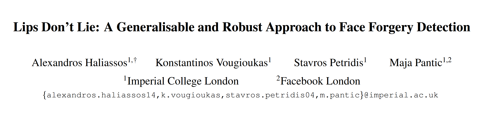
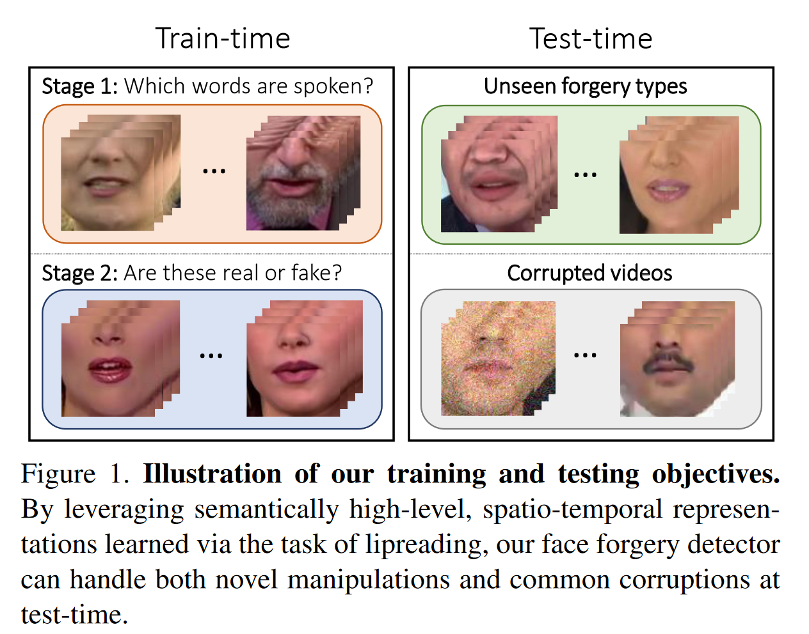
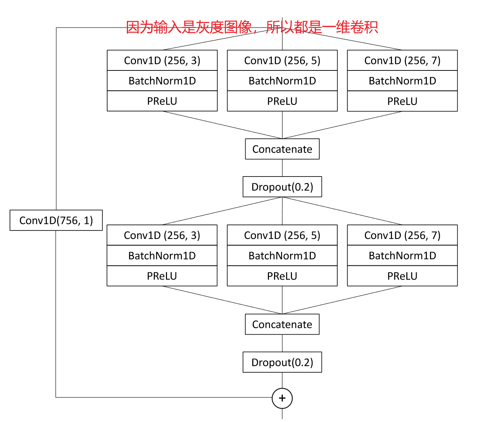
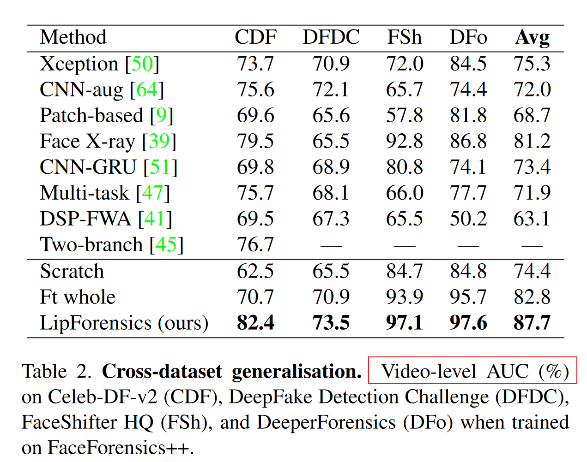

>A. Haliassos, K. Vougioukas, S. Petridis和M. Pantic, 《Lips Don’t Lie: A Generalisable and Robust Approach to Face Forgery Detection》. arXiv, 2021年8月15日. 见于: 2024年3月23日. [在线]. 载于: [http://arxiv.org/abs/2012.07657](http://arxiv.org/abs/2012.07657)

#### Motivation:

**Background:**

尽管目前基于深度学习的人脸伪造检测器在受限场景下取得了令人印象深刻的性能，但它们容易受到不可见的操作方式所产生的样本的影响。最近的一些工作在泛化方面有所改进，但依赖于容易被压缩等常见后处理操作破坏的线索。

**Address:**

* 通过**区分自然的和异常的嘴部运动**来解决构建一个通用的、鲁棒的人脸伪造分类器的问题。
* 假设嘴部运动的不规则性存在于**用任何方法生成的假视频**中（*泛化性*）。由于这些线索在语义上的高层性（high-level cues），它们也更**不容易被常见的扰动所破坏**（*鲁棒性*）。然而，仅仅在嘴唇数据上训练的时空卷积神经网络并不一定会学习到所需的特征，因为它可能会根据其他更多的操作特定的线索来分离数据。为了解释这一点，我们采取了两步法。
  * **预训练：**在唇读任务上预训练一个CNN（**只使用真实的唇部数据**），该CNN由一个时空特征提取器（[LR-FE](#LR-FE)）和一个时间卷积网络（[MS-TCN](#MS-TCN)）组成。我们预期这一过程会在高层语义空间中诱发出对嘴部异常动态敏感的内部表征，更关注唇部异动性。
  * **微调：**冻结了特征提取器（[LR-FE](#LR-FE)），并在**伪造数据**上微调时间卷积网络（[MS-TCN](#MS-TCN)），输出接到2分类，进行预测。

**QAQ:**

* 假设很重要：观察到了在Deepfake中唇部的伪造痕迹是个重要的线索

* 在假设的基础上**迁移其他领域的模型**，在此基础上微调到Deepfake领域。查看具体网络架构可知，模型都是别人在其他领域的model，拿来微调的。

* 关于`时空网络`的启发：在对于视频检测时，考虑时间顺序的不一致性（前后帧的异常行为）

  >3维时空信息提取与训练（空间2维：H W；时间1维：时序性（帧与帧之间））
  >
  >**时空特征提取**：为了捕获视频中的时空信息，通常会使用3D卷积神经网络（3D CNN）或类似的模型架构。这些模型不仅在空间上执行卷积操作，还在时间上执行卷积操作，从而考虑到视频中的时序信息。通过这种方式，模型可以同时利用帧间的相关性和帧内的空间信息。**时序建模**：除了3D卷积层外，模型通常还会包括循环神经网络（Recurrent Neural Networks，RNNs）或长短期记忆网络（Long Short-Term  Memory，LSTM）等结构，用于对时间序列进行建模。这些结构能够捕获视频中帧与帧之间的动态变化，并在模型中建立时间的依赖关系。**动作识别和预测**：经过训练的模型可以用于识别视频中的动作或预测未来的动作。这通常涉及将模型的输出连接到一个分类器或回归器，以识别视频中出现的动作或预测未来的动态变化。

#### Novelty:

* 提出了LipForensics，一种既能泛化到新颖的操作，又能抵抗各种失真的检测方法。

#### Method:

**Framwork:**

网络的输入由25个**灰度（只有一个channel）**、对齐的嘴唇部分切片(我们只展示了四个用于说明的目的)组成。它们通过一个**冻结的特征提取器**（Lip Reading Feature Extract, LR-FE）(一个带有初始三维卷积层的ResNet - 18)，它已经在唇读上预训练，因此输出对嘴部运动敏感的嵌入。同样在唇读上预训练的**多尺度时间卷积网络**( Multiscale Temporal Convolutional Network，MS-TCN )被微调，以检测基于语义的嘴部运动中的高级违规行为的虚假视频。

**LR-FE:**

* 在Lipreading in the Wild ( LRW ) [13][2]上进行预训练，该数据集包含了超过50万条语音，跨越了数百个不同姿态的说话人。它使用[ 43 ][1]中提出的方法进行训练。

* 特征提取器是一个ResNet - 18 ，它具有一个初始的三维卷积层，通过填充保留时间维度。特征提取器为每个输入帧输出一个512维的特征向量。

**MS-TCN:**

时序网络是一种多尺度时序卷积网络( MSTCN ) [ 44 ][3]，通过串联多个分支的输出，将每层的短期和长期时间信息结合起来，每个分支具有不同的时间感受野。经过一个时态全局平均池化层后，一个任务特定的线性分类器输出估计的类别概率。

#### Expriment:

[1]:https://ieeexplore.ieee.org/abstract/document/9415063	"Towards practical lipreading with distilled and efficient models."
[2]:https://link.springer.com/chapter/10.1007/978-3-319-54184-6_6	"Lip reading in the wild."
[3]:https://ieeexplore.ieee.org/abstract/document/9053841Lipreading "using temporal convolutional networks."

