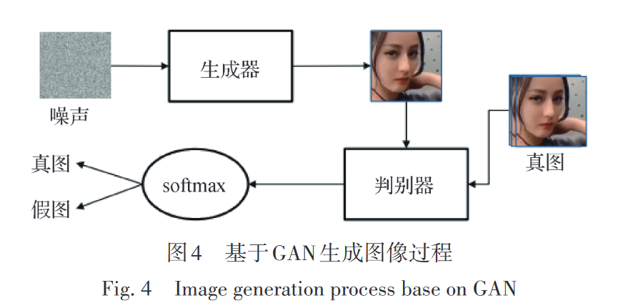
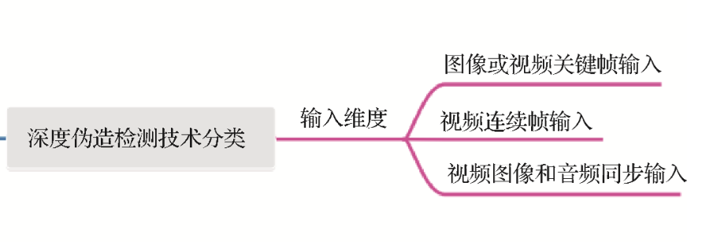
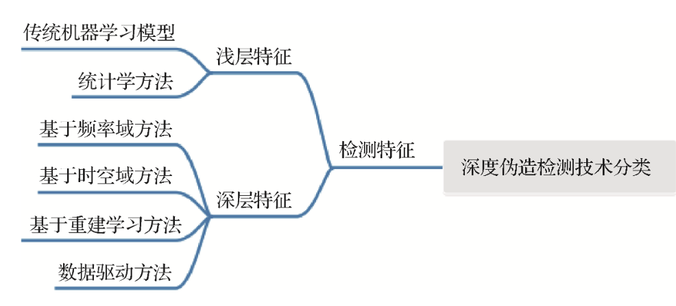

#### 深度伪造算法：

* **自 编 码 器（autoencoder）：**
  自 编 码 器 结 构 由 两 个 卷 积 神 经 网 络（convolu⁃ tional neural networks，**CNNs**）组成，分别作为**编码器** 和解码器。

  编码器将输入目标的面部图像进行降维，编码成对应面部特征的向量，为了使编码器网络只学习到通用的特征描述，让编码器的参数进行共享（Ding 等，2020），即**通用同一个编码器**。再将提取出来的 面部特征向量送入每个原始面部专属的解码器来尽可能地还原面部，在提取特征和还原面部的过程中进行网络学习。

  > FaceSwap、Deepfake就是这样生成的。

  

* **生成对抗网络（generative adversarial network，GAN）：**
  生成对抗网络的结构使用了一个**生成器**和一 个判别器，生成器类似于自编码器的解码器，将输入的噪声转换成图像，与真实存在的图像送入判别器进行辨别。

  判别器和生成器均使用**反向传播**来优化参数， 当**判别器**尚能分辨生成器输出与现实存在图像时， 对**生成器**的参数进行优化以提升生成图像质量；对 判别器的参数进行优化以提升判别器分辨准确率， 达到**纳什均衡**时模型优化至最佳。
  

  
  
  
* **扩 散 模 型（diffusion model）：**

  扩散模型的骨干网络一般采用输入和输出相同 尺寸的 U-Net 网络。在采样过程中如果在中间插入 要更改的图像可以生成相同风格的图像，以达到换 脸的效果。

#### 检测——输入维度

* 图像或视频关键帧输入：最常用的方式，抽取视频帧来进行训练。
* 视频连续帧输入：这里更进一步捕捉视频帧间不一致的信息，对于视频判假十分有效。
* 视频图像和音频同步输入：多模态检测，利用音视频信息联合判真伪。

#### 检测——检测特征

* **基于频率域的方法:**

  >​	Frank等人（2020）的方法是针对 deepfake 图像进行检测的一种策略。在这个方法中，他们利用生成对抗网络（GAN）生成了一些 deepfake 图像以及真实图像。然后，对这些图像进行**离散余弦变换**（Discrete Cosine Transform，DCT），这是一种常用于将图像**从空间域转换到频率域**的方法。在 DCT 变换后，他们向生成的 deepfake 图像中添加一些扰动，目的是消除频率级别上的伪影，使得 deepfake 图像更难以被识别。
  >
  >​	随后，Frank等人将原始图像和添加了假扰动的图像一起输入分类器进行判别。这个分类器可能是一个深度学习模型，比如卷积神经网络（CNN），用来区分真实图像和 deepfake 图像。这种方法的优势在于它具有很强的泛化能力，即使在面对新的 deepfake 变体时也能有效地检测出来。通过在分类器中同时考虑原始图像和添加了扰动的图像，可以使得分类器更加鲁棒，从而提高了检测的准确性和泛化能力。

  1. **频率域表示**：将图像转换为频率域表示，常用的方法包括傅里叶变换（Fourier Transform）和小波变换（Wavelet Transform）。这些变换可以将图像从空间域转换到频率域，使得频率信息更加明显。
  2. **特征提取**：在频率域中，对图像进行特征提取。这些特征可能包括频谱分布、频率分量的幅度和相位等。在 deepfake 检测中，可以通过分析 deepfake 图像与真实图像的频率特征差异来进行识别。
  3. **优点：**可解释性比较强，抓住了生成过程上的不一致缺陷。
  4. **缺点：**抗干扰能力较弱，对于带有扰动的输入判别能力会下降 ，如上采样 、下采样和噪声等。

* **基于时空域的方法：**

  >视频可以视为**帧序列**和 **同步的音频信号**具有**时序性**和**空间信息**，在伪造视频生成过程中往往只注重人脸位置和特征的匹配， 这就会出现违反物理规律和人体生理学的破绽。

  1. **优点：**解释性和直观性 很强，能使非技术人员也明白其取证原理。
  2. **缺点：**强烈依赖于几个特征，泛用性受到了限制，例如基于耳部特征、嘴唇特征（Lips）。

* **基于重建学习的方法:**

  > 该方法用真实样本训练网络模型，并直接将**重建误差较大**的样本识别为深度伪造产物。
  >
  > Cao 等人（2022）提出了一种基于重 建分类学习的深度伪造检测框架，用**重建差异**突出图像上**伪造痕迹**的信号，并将其输入分类器进行伪 造检测。Shiohara 和 Yamasaki （2022）提出了一种自 混合图像**（self-blended images）**重建合成方法来训练 模型，用于检测混合源图像和伪造图像之间的**边界不一致** 。

  1. **优点：**该方法目前比较新颖，可以通过重建学习放大伪造产物的伪影，对于提升检测器的性能 有很大帮助。
  2. **缺点：**重建学习方法需要重新采样生成中间样本，过程复杂，检测成功率也完全取决于重建样本的质量，如果不能很好地选择重建的特征，检测的效果可能会恶化。

* 数据驱动方法:

  >这类检测方法不针对特定特征，而是用监督学习的方式将真实视频和伪造视频 送入模型进行训练。这种方法**类似于深度学习上的图像分类问题**，将特征交由网络自身提取和学习，只是这里的分类为真实视频和伪造视频两种。
  >
  >如 今 大 多 数 新 的 数 据 驱 动 方 法 都 以 **Effi⁃ cientNet**和 **Xception** 为基准进行性能参照。

  1. **优点：**不针对特定特征，网络能学习到人们观察不 到的潜在伪造痕迹，因此泛化能力较强，也能较好地 与新出现的深度学习方法进行结合
  2. **缺点：**其解释性不够好，对数据驱动深度伪造检测方法的推广和改进带来了困难。

#### 未来挑战与发展前景

* **跨数据集的泛化能力：**

* * 如 Yu 等人（2021）先训练了一个**图像隐写**（Zhang 等，2014；Qin 等，2013）的编码器和解码器，以将**人 工的“指纹”和数字水印**（Li 等，2011；Qin 等，2012； Wang 等，2018）嵌入到用于训练的图像中，从而更简 单高效地对深度伪造产物进行检测和溯源
  * Hasan 和 Salah（2019）使用**区块链**（Tan 等，2022）和智 能合约的方法来对多媒体内容进行认证，帮助用户 溯源以避免被伪造内容欺骗。

* **反取证工作：**
  近年来 已有对现有深度伪造检测算法进行**对抗性攻击**的研究 ，例 如 Neves 等 人（2020）的 GANprintR（GANfingerprint removal approach）就针对能有效被捕捉的 GAN 生成伪造图像的**“指纹”进行消除**，能在保持人 脸质量的同时对捕捉指纹的检测算法进行**欺骗**。

* **其他形式的深度伪造：**

  目前深度伪造检测工 作主要着眼于人脸在视频和图像上的篡改工作，但 深度伪造在其他领域的产物也是潜在的问题。

  * 音频领域
  * 卫星图像的国土安全领域

