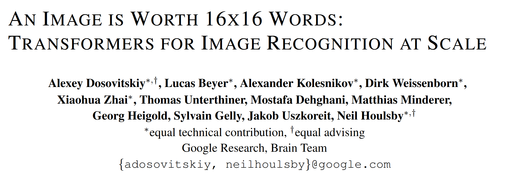

<center></center>

>声明：本博客参考——[知乎](https://zhuanlan.zhihu.com/p/356155277)

从 2020 年，transformer 开始在 CV 领域大放异彩：图像分类（ViT, DeiT），目标检测（DETR，Deformable DETR），语义分割（SETR，MedT），图像生成（GANsformer）等。而从深度学习暴发以来，CNN 一直是 CV 领域的主流模型，而且取得了很好的效果，相比之下 transformer 却独霸 NLP 领域，transformer 在 CV 领域的探索正是研究界想把 transformer 在 NLP 领域的成功借鉴到 CV 领域。对于图像问题，卷积具有天然的先天优势（inductive bias）：平移等价性（translation equivariance）和局部性（locality）。而 transformer 虽然不并具备这些优势，但是 transformer 的核心 self-attention 的优势不像卷积那样有固定且有限的感受野，self-attention 操作可以获得 long-range 信息（相比之下 CNN 要通过不断堆积 Conv layers 来获取更大的感受野），但训练的难度就比 CNN 要稍大一些。

ViT（vision transformer）是 Google 在 2020 年提出的直接将 transformer 应用在图像分类的模型，后面很多的工作都是基于 ViT 进行改进的。**ViT 的思路很简单：直接把图像分成固定大小的 patchs，然后通过线性变换得到 patch embedding，这就类比 NLP 的 words 和 word embedding，由于 transformer 的输入就是 a sequence of token embeddings，所以将图像的 patch embeddings 送入 transformer 后就能够进行特征提取从而分类了**。ViT 模型原理如下图所示，其实 ViT 模型只是用了 transformer 的 Encoder 来提取特征（原始的 transformer 还有 decoder 部分，用于实现 sequence to sequence，比如机器翻译）。下面将分别对各个部分做详细的介绍。


### **Patch Embedding**

对于 ViT 来说，首先要**<u>将原始的 2-D 图像转换成一系列 1-D 的 patch embeddings</u>**，这就好似 NLP 中的 word embedding。输入的 2-D 图像记为 $\mathbf x\in \mathbb{R}^{H\times W \times C}$，其中 $H$ 和 $W$ 分别是图像的高和宽，而 $C$为通道数对于 RGB 图像就是 3。如果要将图像分成大小为 $P\times P$的 patchs，可以通过 reshape 操作得到 a sequence of patchs：$\mathbf x_p\in \mathbb{R}^{N\times(P^2\cdot C)}$，图像共切分为 $N=HW/P^2$个 patchs，这也就是 sequence 的长度了，注意这里直接将 patch 拉平为 1-D，其特征大小为 $P^2\cdot C$。然后通过一个简单的线性变换将 patchs 映射到 $D$大小的维度，这就是 patch embeddings：$\mathbf {x'_{p}}\in \mathbb{R}^{N\times D}$，**<u>在实现上这等同于对 $\mathbf x$ 进行一个 $P\times P$ 且 stride 为 $P$的卷积操作</u>**（虽然等同，但是 ViT 其实是不包含任何卷积操作的），下面是具体的实现代码：

```python
class PatchEmbed(nn.Module):
    """ Image to Patch Embedding
    """
    def __init__(self, img_size=224, patch_size=16, in_chans=3, embed_dim=768):
        super().__init__()
        img_size = to_2tuple(img_size)
        patch_size = to_2tuple(patch_size)
        num_patches = (img_size[1] // patch_size[1]) * (img_size[0] // patch_size[0])
        self.img_size = img_size
        self.patch_size = patch_size
        self.num_patches = num_patches

        self.proj = nn.Conv2d(in_chans, embed_dim, kernel_size=patch_size, stride=patch_size)
"""
通过卷积层 self.proj 将输入图像进行卷积操作，从而将图像转换为嵌入表示。这个卷积层 self.proj 在 __init__ 方法中被定义，它是一个 2D 卷积层，用于将输入图像的每个补丁（patch）转换为嵌入表示。这个操作可以看作是将图像分割成多个固定大小的块，并对每个块应用相同的卷积核进行卷积操作，从而得到每个块的特征表示。

接下来，通过 flatten 操作将卷积操作得到的特征张量展平，使得每个补丁的特征表示被连续地存储在一个一维向量中。这样做的目的是将每个补丁的特征表示组合成一个序列，以便后续输入到 Transformer 模型中。

最后，通过 transpose 操作将张量的维度进行转置，使得每个补丁的特征表示被重新排列为批次（batch）、序列长度（sequence length）、特征维度（embedding dimension）的顺序。这样得到的张量就可以作为 Transformer 模型的输入，其中每个补丁的特征表示被看作是一个序列元素，而特征维度则对应于 Transformer 模型中的嵌入维度。
"""
    def forward(self, x):
        B, C, H, W = x.shape
        # FIXME look at relaxing size constraints
        assert H == self.img_size[0] and W == self.img_size[1], \
            f"Input image size ({H}*{W}) doesn't match model ({self.img_size[0]}*{self.img_size[1]})."
        x = self.proj(x).flatten(2).transpose(1, 2)
        return x

```

### **Position Embedding**

除了 patch embeddings，模型还需要另外一个特殊的 position embedding。transformer 和 CNN 不同，**<u>需要 position embedding 来编码 tokens 的位置信息</u>**，这主要是因为 self-attention 是 permutation-invariant（置换不变），即打乱 sequence 里的 tokens 的顺序并不会改变结果。**如果不给模型提供 patch 的位置信息，那么模型就需要通过 patchs 的语义来学习拼图，这就额外增加了学习成本**。ViT 论文中对比了几种不同的 position embedding 方案 (如下），最后发现如果不提供 positional embedding 效果会差，但其它各种类型的 positional embedding 效果都接近，这主要是因为 ViT 的**输入是相对较大的 patchs 而不是 pixels**，所以学习位置信息相对容易很多。

*   无 positional embedding
*   1-D positional embedding：把 2-D 的 patchs 看成 1-D 序列
*   2-D positional embedding：考虑 patchs 的 2-D 位置（x, y）
*   Relative positional embeddings：patchs 的相对位置

transformer 原论文中是默认采用固定的 positional embedding，但 ViT 中默认采用学习（训练的）的 **1-D positional embedding**，在输入 transformer 的 encoder 之前直接**将 patch embeddings 和 positional embedding 相加**:

```python
# 这里多1是为了后面要说的class token，embed_dim即patch embed_dim
self.pos_embed = nn.Parameter(torch.zeros(1, num_patches + 1, embed_dim)) 

# patch emded + pos_embed
x = x + self.pos_embed
```

论文中也对学习到的 positional embedding 进行了可视化，发现相近的 patchs 的 positional embedding 比较相似，而且同行或同列的 positional embedding 也相近：


这里额外要注意的一点，**如果改变图像的输入大小，ViT 不会改变 patchs 的大小，那么 patchs 的数量$N$会发生变化，那么之前学习的 pos_embed 就维度对不上了**，ViT 采用的方案是通过**插值**来解决这个问题：

```python
import math
import torch
import torch.nn.functional as F

def resize_pos_embed(posemb, posemb_new):
    # Rescale the grid of position embeddings when loading from state_dict. Adapted from
    # https://github.com/google-research/vision_transformer/blob/00883dd691c63a6830751563748663526e811cee/vit_jax/checkpoint.py#L224
    # 调整位置嵌入的网格大小，用于从状态字典加载时重新缩放位置嵌入
    _logger.info('Resized position embedding: %s to %s', posemb.shape, posemb_new.shape)
    # 输出日志，记录调整前后位置嵌入的形状
    ntok_new = posemb_new.shape[1]
    # 计算新的补丁数量
    # 除去class token的pos_embed
    # 分离类别标记和位置编码
    posemb_tok, posemb_grid = posemb[:, :1], posemb[0, 1:]
    ntok_new -= 1
    # 从新的补丁数量中减去类别标记的数量
    gs_old = int(math.sqrt(len(posemb_grid)))
    gs_new = int(math.sqrt(ntok_new))
    # 计算原始位置编码网格大小和新的位置编码网格大小
    _logger.info('Position embedding grid-size from %s to %s', gs_old, gs_new)
    # 输出日志，记录原始和新的位置编码网格大小
    # 把pos_embed变换到2-D维度再进行插值
    # 将位置编码网格调整为二维形状以便进行插值
    posemb_grid = posemb_grid.reshape(1, gs_old, gs_old, -1).permute(0, 3, 1, 2)
    posemb_grid = F.interpolate(posemb_grid, size=(gs_new, gs_new), mode='bilinear')
    # 使用双线性插值调整位置编码网格的尺寸到新的网格大小
    posemb_grid = posemb_grid.permute(0, 2, 3, 1).reshape(1, gs_new * gs_new, -1)
    # 将调整后的位置编码网格变换回原来的形状
    posemb = torch.cat([posemb_tok, posemb_grid], dim=1)
    # 将类别标记和调整后的位置编码拼接在一起得到新的位置嵌入张量
    return posemb
    # 返回调整后的位置嵌入张量
```

但是这种情形一般会造成性能少许损失，可以通过 finetune 模型来解决。另外最新的论文 [CPVT](https://link.zhihu.com/?target=https%3A//arxiv.org/abs/2102.10882) 通过 implicit Conditional Position encoding 来解决这个问题（插入 Conv 来隐式编码位置信息，zero padding 让 Conv 学习到绝对位置信息）。

### **Class Token**

除了 patch tokens，ViT 借鉴 BERT 还增加了一个特殊的 **class token**。后面会说，transformer 的 encoder 输入是 a sequence patch embeddings，输出也是同样长度的 a sequence patch features，但图像分类最后需要获取 image feature，简单的策略是采用 pooling，比如求 patch features 的平均来获取 image feature，**但是 ViT 并没有采用类似的 pooling 策略，而是直接增加一个特殊的 class token，其最后输出的特征加一个 linear classifier 就可以实现对图像的分类**（ViT 的 pre-training 时是接一个 MLP head），所以输入 ViT 的 sequence 长度是$N+1$。class token 对应的 embedding 在训练时随机初始化，然后通过训练得到，具体实现如下：

```python
# 随机初始化类别标记
self.cls_token = nn.Parameter(torch.zeros(1, 1, embed_dim))

# 分类器头部
self.head = nn.Linear(self.num_features, num_classes) if num_classes > 0 else nn.Identity()

# 具体forward过程
B = x.shape[0]
# 获取输入的批次大小
x = self.patch_embed(x)
# 对输入图像进行嵌入表示转换
cls_tokens = self.cls_token.expand(B, -1, -1)  # stole cls_tokens impl from Phil Wang, thanks
# 使用广播操作扩展类别标记以匹配输入的批次大小
x = torch.cat((cls_tokens, x), dim=1)
# 将类别标记和转换后的嵌入表示拼接在一起
x = x + self.pos_embed
# 将位置编码加入到嵌入表示中
```

### **Transformer Encoder**

transformer 最核心的操作就是 **self-attention**，其实 attention 机制很早就在 NLP 和 CV 领域应用了，比如带有 attention 机制的 seq2seq 模型，但是 transformer 完全摒弃 RNN 或 LSTM 结构，直接采用 attention 机制反而取得了更好的效果：**attention is all you need！**简单来说，attention 就是根据当前查询对输入信息赋予不同的权重来聚合信息，从操作上看就是一种 “加权平均”。**attention 中共有 3 个概念：query, key 和 value**，其中 key 和 value 是成对的，对于一个给定的 query 向量$q\in \mathbb{R}^{d}$，通过**内积计算**来匹配 k 个 key 向量（维度也是 d，堆积起来即矩阵$K\in \mathbb{R}^{k\times d}$），得到的内积通过 softmax 来归一化得到 k 个权重，那么对于 query 其 attention 的输出就是 k 个 key 向量对应的 value 向量（即矩阵$V\in \mathbb{R}^{k\times d}$）的加权平均值。对于一系列的 N 个 query（即矩阵$Q\in \mathbb{R}^{N\times d}$），可以通过矩阵计算它们的 attention 输出：

$$Attention(Q, K, V) = Softmax(\frac{QK^T}{\sqrt{d_k}})V \\$$

这里的$\sqrt{d_k}$ 为缩放因子以避免点积带来的方差影响。上述的 Attention 机制称为 **Scaled dot product attention**，其实 attention 机制的变种有很多，但基本原理是相似的。如果$Q,K,V$ 都是从一个包含$N$个向量的 sequence（$X\in \mathbb{R}^{N\times D}$）通过线性变换得到：$Q=XW_Q,K=XW_K,V=XW_V$那么此时就变成了 **self-attention**，这个时候就有$N$个（key,value）对，那么$k=N$。self-attention 是 transformer 最核心部分，self-attention 其实就是**输入向量之间进行相互 attention 来学习到新特征**。前面说过我们已经得到图像的 patch sequence，那么送入 self-attention 就能到同样 size 的 sequence 输出，只不过特征改变了。

更进一步，transformer 采用的是 **multi-head self-attention (MSA）**，所谓的 MSA 就是采用定义 h 个 attention heads，即采用 h 个 self-attention 应用在输入 sequence 上，在操作上可以将 sequence 拆分成 h 个 size 为$N\times d$ 的 sequences，这里$D=hd$，h 个不同的 heads 得到的输出 concat 在一起然后通过线性变换得到最终的输出，size 也是$N\times D$：

$$MSA(X) = Concat(head_1, ..., head_h) W^O, head_i=SA(XW_i^Q, XW_i^K, XW_i^V) \\$$


MSA 的计算量是和$N^2$ 成正相关的，所以 ViT 的输入是 patch embeddings，而不是 pixel embeddings，这有计算量上的考虑。在实现上，MSA 是可以并行计算各个 head 的，具体代码如下：

```python
class Attention(nn.Module):
    def __init__(self, dim, num_heads=8, qkv_bias=False, qk_scale=None, attn_drop=0., proj_drop=0.):
        super().__init__()
        # 初始化注意力机制
        self.num_heads = num_heads
        head_dim = dim // num_heads
        # 计算头部维度
        
        self.scale = qk_scale or head_dim ** -0.5
        # 计算缩放系数
        
        self.qkv = nn.Linear(dim, dim * 3, bias=qkv_bias)
        # 定义线性变换层，用于计算查询、键、值
        self.attn_drop = nn.Dropout(attn_drop)
        # 定义dropout层，用于注意力权重
        self.proj = nn.Linear(dim, dim)
        # 定义线性变换层，用于计算输出
        self.proj_drop = nn.Dropout(proj_drop)
        # 定义dropout层，用于输出

    def forward(self, x):
        # 前向传播函数
        B, N, C = x.shape
        # 获取输入张量的形状
        qkv = self.qkv(x).reshape(B, N, 3, self.num_heads, C // self.num_heads).permute(2, 0, 3, 1, 4)
        """
        这行代码的作用是将输入张量 x 经过线性变换 self.qkv 后，按照特定的维度顺序进行重塑和转置，以便后续的注意力计算。具体解释如下：

        self.qkv(x): 将输入张量 x 经过线性变换层 self.qkv，得到一个形状为 (B, N, 3 * num_heads, C // num_heads) 的张量，其中 B 表示批次大小，N 表示序列长度，C 表示输入的特征维度。

        .reshape(B, N, 3, num_heads, C // num_heads): 将线性变换后的张量进行重塑，将其形状变为 (B, N, 3, num_heads, C // num_heads)，其中维度的含义如下：
        第一个维度 B：批次大小
        第二个维度 N：序列长度
        第三个维度 3：表示查询（Q）、键（K）、值（V）三种信息
        第四个维度 num_heads：注意力头的数量
        第五个维度 C // num_heads：每个注意力头的特征维度
        
        .permute(2, 0, 3, 1, 4): 对重塑后的张量进行维度交换，得到最终的形状 (3, B, num_heads, N, C // 	   num_heads)，其中维度的含义如下：
        第一个维度 3：表示查询（Q）、键（K）、值（V）三种信息
        第二个维度 B：批次大小
        第三个维度 num_heads：注意力头的数量
        第四个维度 N：序列长度
        第五个维度 C // num_heads：每个注意力头的特征维度
        这样的处理方式使得每个注意力头可以独立计算注意力权重，从而提高了并行性能，同时保持了每个头的维度信息，以便后续的注意力计算。
        """
        # 使用线性变换计算查询、键、值，并进行重塑和转置操作，以便后续计算
        q, k, v = qkv[0], qkv[1], qkv[2]   # make torchscript happy (cannot use tensor as tuple)
        # 拆分查询、键、值
        
        attn = (q @ k.transpose(-2, -1)) * self.scale
        # 计算注意力权重
        """
        这行代码计算了自注意力机制中的注意力权重。自注意力机制通过计算查询（Q）和键（K）之间的相似度，然后根据相似度加权值（值V）来获取最终的输出。

        具体解释如下：

        - `q` 是查询（Query）的张量，形状为 `(B, num_heads, N, head_dim)`，其中 `B` 表示批次大小，`num_heads` 表示注意力头的数量，`N` 表示序列长度，`head_dim` 表示每个注意力头的特征维度。

        - `k.transpose(-2, -1)` 对键（Key）的张量进行转置操作，将其形状从 `(B, num_heads, N, head_dim)` 转换为 `(B, num_heads, head_dim, N)`，以便与查询张量进行矩阵乘法。

        - `q @ k.transpose(-2, -1)` 对查询张量和转置后的键张量进行矩阵乘法，得到的结果形状为 `(B, num_heads, N, N)`，表示每个位置的查询与所有位置的键的相似度。

        - `(q @ k.transpose(-2, -1)) * self.scale` 对相似度矩阵进行缩放，缩放系数 `self.scale` 通常是注意力头维度的倒数的平方根，用于控制相似度的范围。这样可以避免在计算 softmax 函数时出现梯度爆炸或梯度消失的问题。

        这行代码的结果是一个形状为 `(B, num_heads, N, N)` 的张量，表示每个位置与其他位置的相似度。这些相似度将在后续的 softmax 操作中用于计算注意力权重。
        """
        attn = attn.softmax(dim=-1)
        # 对注意力权重进行softmax操作
        attn = self.attn_drop(attn)
        # 对注意力权重进行dropout操作

        x = (attn @ v).transpose(1, 2).reshape(B, N, C)
        # 计算加权值，并将结果重塑为与输入相同的形状
        x = self.proj(x)
        # 对加权值进行线性变换
        x = self.proj_drop(x)
        # 对线性变换的结果进行dropout操作
        return x
        # 返回注意力机制的输出

```

在 transformer 中，MSA 后跟一个 FFN（Feed-forward network），这个 FFN 包含两个 FC 层，第一个 FC 层将特征从维度$D$变换成$4D$，后一个 FC 层将特征从维度$4D$ 恢复成$D$，中间的非线性激活函数采用 GeLU，其实这就是一个 MLP，具体实现如下：

```python
class Mlp(nn.Module):
    def __init__(self, in_features, hidden_features=None, out_features=None, act_layer=nn.GELU, drop=0.):
        super().__init__()
        out_features = out_features or in_features
        hidden_features = hidden_features or in_features
        self.fc1 = nn.Linear(in_features, hidden_features)
        self.act = act_layer()
        self.fc2 = nn.Linear(hidden_features, out_features)
        self.drop = nn.Dropout(drop)

    def forward(self, x):
        x = self.fc1(x)
        x = self.act(x)
        x = self.drop(x)
        x = self.fc2(x)
        x = self.drop(x)
        return x

```

那么一个完成 transformer encoder block 就包含一个 MSA 后面接一个 FFN，其实 MSA 和 FFN 均包含和 ResNet 一样的 skip connection，另外 MSA 和 FFN 后面都包含 layer norm 层，具体实现如下：

```python
class Block(nn.Module):

    def __init__(self, dim, num_heads, mlp_ratio=4., qkv_bias=False, qk_scale=None, drop=0., attn_drop=0.,
                 drop_path=0., act_layer=nn.GELU, norm_layer=nn.LayerNorm):
        super().__init__()
        self.norm1 = norm_layer(dim)
        self.attn = Attention(
            dim, num_heads=num_heads, qkv_bias=qkv_bias, qk_scale=qk_scale, attn_drop=attn_drop, proj_drop=drop)
        # NOTE: drop path for stochastic depth, we shall see if this is better than dropout here
        self.drop_path = DropPath(drop_path) if drop_path > 0. else nn.Identity()
        self.norm2 = norm_layer(dim)
        mlp_hidden_dim = int(dim * mlp_ratio)
        self.mlp = Mlp(in_features=dim, hidden_features=mlp_hidden_dim, act_layer=act_layer, drop=drop)

    def forward(self, x):
        x = x + self.drop_path(self.attn(self.norm1(x)))
        x = x + self.drop_path(self.mlp(self.norm2(x)))
        return x
```

### **ViT**

对于 ViT 模型来说，就类似 CNN 那样，不断堆积 transformer encoder blocks，最后提取 class token 对应的特征用于图像分类，论文中也给出了模型的公式表达，其中（1）就是提取图像的 patch embeddings，然后和 class token 对应的 embedding 拼接在一起并加上 positional embedding；（2）是 MSA，而（3）是 MLP，（2）和（3）共同组成了一个 transformer encoder block，共有$L$L 层；（4）是对 class token 对应的输出做 layer norm，然后就可以用来图像分类。


除了完全无卷积的 ViT 模型外，论文中也给出了 Hybrid Architecture，简单来说就是先用 CNN 对图像提取特征，从 CNN 提取的特征图中提取 patch embeddings，CNN 已经将图像降采样了，所以 patch size 可以为$1\times 1$1\times 1。

ViT 模型的超参数主要包括以下，这些超参数直接影响模型参数以及计算量：

1.  Layers：block 的数量；
2.  Hidden size D：隐含层特征，D 在各个 block 是一直不变的；
3.  MLP size：一般设置为 4D 大小；
4.  Heads：MSA 中的 heads 数量；
5.  Patch size：模型输入的 patch size，ViT 中共有两个设置：14x14 和 16x16，这个只影响计算量；

类似 BERT，ViT 共定义了 3 中不同大小的模型：Base，Large 和 Huge，其对应的模型参数不同，如下所示。如 ViT-L/16 指的是采用 Large 结构，输入的 patch size 为 16x16。


### **模型效果**

ViT 并不像 CNN 那样具有 inductive bias，论文中发现如果如果直接在 ImageNet 上训练，同 level 的 ViT 模型效果要差于 ResNet，但是如果在比较大的数据集上 petraining，然后再 finetune，效果可以超越 ResNet。比如 ViT 在 Google 私有的 300M JFT 数据集上 pretrain 后，在 ImageNet 上的最好 Top-1 acc 可达 88.55%，这已经和 ImageNet 上的 SOTA 相当了（Noisy Student EfficientNet-L2 效果为 88.5%，Google 最新的 SOTA 是 Meta Pseudo Labels，效果可达 90.2%）：


那么 ViT 至少需要多大的数据量才能和 CNN 旗鼓相当呢？这个论文也做了实验，结果如下图所示，从图上所示这个预训练所使用的数据量要达到 100M 时才能显示 ViT 的优势。transformer 的一个特色是它的 scalability：当模型和数据量提升时，性能持续提升。在大数据面前，ViT 可能会发挥更大的优势。


此外，论文中也对 ViT 做了进一步分析，如分析了不同 layers 的 mean attention distance，这个类比于 CNN 的感受野。论文中发现前面层的 “感受野” 虽然差异很大，但是总体相比后面层 “感受野” 较小，而模型后半部分 “感受野” 基本覆盖全局，和 CNN 比较类似，说明 ViT 也最后学习到了类似的范式。


当然，ViT 还可以根据 attention map 来可视化模型具体关注图像的哪个部分，从结果上看比较合理：


我个人觉得 ViT 算是一个很好的开始，虽然 ViT 也有一些问题，但是至少证明了纯粹的 transformer 在 CV 领域应用的可能性。近期也有一些后续的改进工作，感兴趣的可以进一步了解：

*   [DeiT] Training data-efficient image transformers & distillation through attention
*   [T2T-ViT] Tokens-to-Token ViT: Training Vision Transformers from Scratch on ImageNet
*   [CPVT] Do We Really Need Explicit Position Encodings for Vision Transformers?
*   [PVT] Pyramid Vision Transformer: A Versatile Backbone for Dense Prediction without Convolutions
*   [TNT] Transformer in Transformer

### **参考**

1.  [An Image is Worth 16x16 Words: Transformers for Image Recognition at Scale](https://link.zhihu.com/?target=https%3A//arxiv.org/abs/2010.11929)
2.  [timm](https://link.zhihu.com/?target=https%3A//github.com/rwightman/pytorch-image-models)
3.  [Awesome-Visual-Transformer](https://link.zhihu.com/?target=https%3A//github.com/dk-liang/Awesome-Visual-Transformer)
4.  [Do We Really Need Explicit Position Encodings for Vision Transformers?](https://link.zhihu.com/?target=https%3A//arxiv.org/abs/2102.10882)